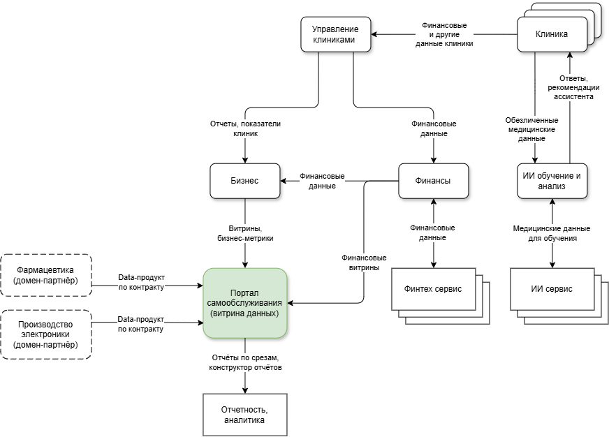

# Разделение системы на домены и моделирование потоков данных для поддержки ключевых бизнес-сценариев

| Домен                | Бизнес-сценарий                                                                                                                      |
|----------------------|--------------------------------------------------------------------------------------------------------------------------------------|
| Клиника              | Медицинские персонализированные данные остаются в клинике                                                                            |
| Управление клиниками | Нужна вся картина по клиникам в головном офисе; Собирает финансовые данные со всех клиник                                         |
| ИИ обучение и анализ | Работает с медицинскими данными; Данные обезличенны; Для ИИ сервисов                                                           |
| Бизнес               | Работает с золотым источником; Собирает финансовые данные и бизнес метрики с других доменов; Для бизнес аналитики и отчетности |
| Финансы              | Ведение отчетности; Более жесткие требования к безопасности; Подключение финтех сервисов                                       |
| Фармацевтика (партнёр) | Будущий домен экосистемы; Свои данные по препаратам, поставкам, назначениям; Подключается публикацией data-продукта по контракту, без доработки DWH и центральной логики |
| Производство электроники (партнёр) | Будущий домен экосистемы; Телеметрия и данные по мед. оборудованию, сервисным обращениям; Подключается тем же контрактом, что и любой другой домен |

## Схема потоков данных между доменами

Ключевое на схеме — «Портал самообслуживания (витрина данных)». Домены не отдают данные напрямую в отчётность: каждый публикует свой data-продукт в витрину, а сотрудник строит по ней отчёт в пределах своего доступа. Из этого следуют два сценария:

- **Подключение нового партнёра (фармацевтика, электроника).** Домен появляется на схеме пунктиром и подключается одной стрелкой — «Data-продукт по контракту». Ни один существующий поток при этом не меняется, центральная логика не дорабатывается.
- **Медицинские данные не попадают в витрину.** У доменов «Клиника» и «ИИ обучение и анализ» нет стрелки в портал: медкарты, истории болезни и результаты исследований остаются внутри своего контура, наружу уходят только обезличенные данные — и только в ИИ-домен, для обучения, а не для аналитики.

## Обоснование

- Ускорение time-to-market. Новый финтех-продукт или новый партнёр выходит на рынок, публикуя один data-продукт по одному контракту — не нужно ждать доработки общей логики, согласования с другими доменами или миграции схемы DWH.
- Независимое развитие направлений.
- Нет центральной команды хранилища. Затраты ниже, ниже зависимость от ИТ.
- Домен отвечает за качество данных.
- Данные передаются между доменами, а не всем сразу. Проще следить и обеспечить безопасность.
- Более узкий периметр комплаенса. Домен обеспечивает безопасность данных в необходимой мере.

