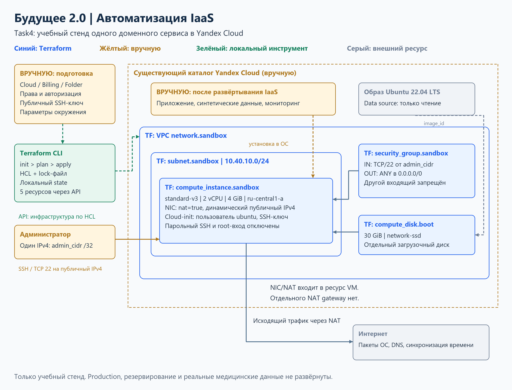

# Задание 4. IaaS и Terraform

Подготовлен учебный стенд в Yandex Cloud по материалу «Управление облачной инфраструктурой и Infrastructure as Code»: одна ВМ, отдельный загрузочный SSD, VPC, подсеть, security group и публичный IPv4 через NAT сетевого интерфейса.

**Статус:** конфигурация и схема готовы; init, fmt, validate и 7 mock-тестов выполнены успешно. Реальные plan/apply остановились из-за отсутствующих параметров целевого облака. Облачные ресурсы не созданы, скриншота успешного apply пока нет. Подробности: [отчёт проверки](verification.md).

## Состав

| Файл | Назначение |
|---|---|
| [main.tf](main.tf) | Провайдер, пять ресурсов IaaS, зависимости, cloud-init |
| [variables.tf](variables.tf) | Параметры и проверки допустимых значений |
| [outputs.tf](outputs.tf) | Идентификаторы, адреса, SSH-команда, выбранный образ |
| [terraform.tfvars](terraform.tfvars) | Общие значения для учебного стенда |
| [.terraform.lock.hcl](.terraform.lock.hcl) | Зафиксированный провайдер и контрольные суммы |
| [diagram.png](diagram.png) | Компонентная схема с границами автоматизации |
| [diagram.mmd](diagram.mmd) | Текстовая схема в Mermaid |
| [justification.md](justification.md) | Выбор ресурсов, NAT, IaC и ограничения |
| [tests/sandbox.tftest.hcl](tests/sandbox.tftest.hcl) | Проверки без реального облака |
| [verification.md](verification.md) | Фактические результаты и оставшиеся шаги |
| [terraform.rc.example](terraform.rc.example) | Необязательное зеркало провайдера |
| [scripts/render_diagram.py](scripts/render_diagram.py) | Воспроизводимая генерация PNG |



## Границы задания

Это небольшой sandbox для тестирования одного доменного сервиса и IaC из этапа П2 Task3. Он не предназначен для медицинских/банковских записей, обучения ИИ или размещения всего lakehouse. Полное промышленное окружение Task1 не заявляется созданным.

Terraform создаёт **пять ресурсов**: network, subnet, security group, disk и instance. Публичный адрес заказывается через `nat = true` у NIC ВМ, отдельный NAT gateway не создаётся. Ubuntu берётся из существующего каталога образов через data source; источник данных не считается создаваемым ресурсом.

Вручную до запуска: облако, платёжный аккаунт, каталог, полномочия оператора Terraform и SSH-ключ на компьютере администратора. После запуска: установка и конфигурирование тестового приложения, его данных и мониторинга. Создание OS-пользователя и настройка входа по ключу выполняются автоматически cloud-init.

## Требования

- Terraform 1.x версии не ниже 1.7; фактическая проверка выполнена на **1.13.5**, это выбранная проверенная версия, не утверждение о последней доступной.
- Провайдер `yandex-cloud/yandex 0.161.0` закреплён в коде и lock-файле. Обновление выполняется отдельным проверяемым изменением.
- Существующий выделенный каталог Yandex Cloud с подключённым биллингом и доступной квотой: 2 vCPU, 4 GiB RAM, 30 GiB network-ssd, один публичный IPv4.
- Учётная запись Terraform с разрешениями управления Compute и VPC в этом каталоге. Выдача прав производится администратором по принятой политике; код не создаёт IAM-ключи и не назначает роли.
- IAM-токен в `YC_TOKEN` **или** локальный путь к ключу сервисного аккаунта в `YC_SERVICE_ACCOUNT_KEY_FILE`.
- Ваш публичный Ed25519 SSH-ключ и реальный исходящий IPv4 администратора в формате `x.x.x.x/32`. Приватный ключ остаётся у вас.

## Настройка параметров в PowerShell

Команды выполняются из Task4. Значения в угловых скобках замените своими. Секреты не вставляйте в чат и не коммитьте в Git.

Если YC CLI уже установлен и авторизован:

```powershell
$env:YC_TOKEN = (yc iam create-token)
$env:TF_VAR_cloud_id = (yc config get cloud-id)
$env:TF_VAR_folder_id = (yc config get folder-id)
$env:TF_VAR_admin_cidr = "<ваш-публичный-IPv4>/32"
$env:TF_VAR_ssh_public_key = (Get-Content -Raw "$env:USERPROFILE/.ssh/id_ed25519.pub").Trim()
```

Вместо токена можно задать `YC_SERVICE_ACCOUNT_KEY_FILE` с путём к уже существующему авторизованному ключу сервисного аккаунта. Файл ключа должен храниться вне репозитория. При использовании сервисного аккаунта задайте правильные `TF_VAR_cloud_id` и `TF_VAR_folder_id` явно.

Нечувствительные локальные значения также можно сохранить в `local.auto.tfvars`, который исключён из Git. Отсутствие target-specific значений в общем `terraform.tfvars` намеренно: фиктивные ID и ключи не превращают проект в развёрнутую инфраструктуру.

Если установленного Terraform нет в PATH, для текущей рабочей копии доступен загруженный исполняемый файл `.tools/terraform-1.13.5/terraform.exe`. Он не включается в репозиторий. Можно на время сессии добавить его каталог в PATH:

```powershell
$env:PATH = "$(Resolve-Path ./.tools/terraform-1.13.5);$env:PATH"
```

При недоступности registry можно включить официальный mirror только для текущей сессии:

```powershell
$env:TF_CLI_CONFIG_FILE = (Resolve-Path ./terraform.rc.example).Path
```

Глобальные настройки Terraform при этом не меняются.

## Инициализация и проверки

```powershell
terraform init -input=false
terraform fmt -check -recursive
terraform validate
terraform test
```

Последняя команда использует `mock_provider`: она проверяет конфигурацию без авторизации и без платных ресурсов. Успешный mock apply внутри теста **не заменяет** реальный `terraform apply`.

## Реальное развёртывание

1. Проверьте целевой каталог, стоимость ресурсов и отсутствие нужных данных в sandbox.
2. Получите и просмотрите сохранённый план:

```powershell
terraform plan -input=false -out=sandbox.tfplan
if ($LASTEXITCODE -ne 0) { throw "Terraform plan failed" }
terraform show -no-color sandbox.tfplan
```

В чистом каталоге/state ожидается **5 to add, 0 to change, 0 to destroy**. Это ожидаемый состав кода, а не результат уже выполненного облачного plan. Если план содержит изменение или удаление существующих ресурсов, сначала разберите расхождение.

3. Примените именно проверенный план:

```powershell
terraform apply -input=false sandbox.tfplan
if ($LASTEXITCODE -ne 0) { throw "Terraform apply failed" }
terraform output
```

Применение сохранённого плана начинается без дополнительного вопроса Terraform и создаёт платные ресурсы. Plan-файл и state не публикуйте.

4. Проверьте ВМ:

```powershell
$vmAddress = terraform output -raw public_ip
ssh "ubuntu@$vmAddress" "cloud-init status --wait; hostname; free -h; df -h /"
terraform plan -input=false -detailed-exitcode
```

Для SSH используйте соответствующий приватный ключ через SSH agent либо параметр `-i`. Проверяйте fingerprint сервера; не отключайте проверку host key. Если изменили `ssh_user`, используйте имя из output `ssh_command`. Статус cloud-init должен быть успешным; повторный plan возвращает 0 при отсутствии изменений, 2 при наличии изменений и 1 при ошибке.

5. Сохраните **настоящий скриншот терминала после успешного apply** в `evidence/apply-success.png`. На нём должны быть видны команда и строка `Apply complete!`; не показывайте токены и ключи. В [verification.md](verification.md) обновите статус и приложите результат SSH/повторного plan. Пока этого нет, пункт 3 задания не считается завершённым.

## Состояние и жизненный цикл

Локальный state выбран для одиночного учебного запуска. Сохраняйте его защищённую копию: потеря state не удаляет облачные ресурсы, но лишает Terraform их учёта. Для команды нужен отдельно подготовленный удалённый backend с проверенной блокировкой, ограниченным доступом и резервированием; он не изображён как уже созданный.

`auto_delete = false` сохраняет загрузочный диск при удалении только ВМ, но **terraform destroy удалит и сам ресурс диска**. Изменение CPU/RAM может остановить ВМ, потому что `allow_stopping_for_update = true`. Динамический публичный IP может измениться после остановки: читайте output заново.

Перед завершением лабораторной работы удалите только созданный стенд, если его данные больше не нужны:

```powershell
terraform plan -destroy -out=destroy.tfplan
terraform show -no-color destroy.tfplan
# После проверки состава удаляемых ресурсов:
terraform apply destroy.tfplan
```

Автоматическое удаление в этом проекте не запускалось. Остановка ВМ не равна удалению ресурсов: диски и зарезервированные ресурсы могут продолжать тарифицироваться.
