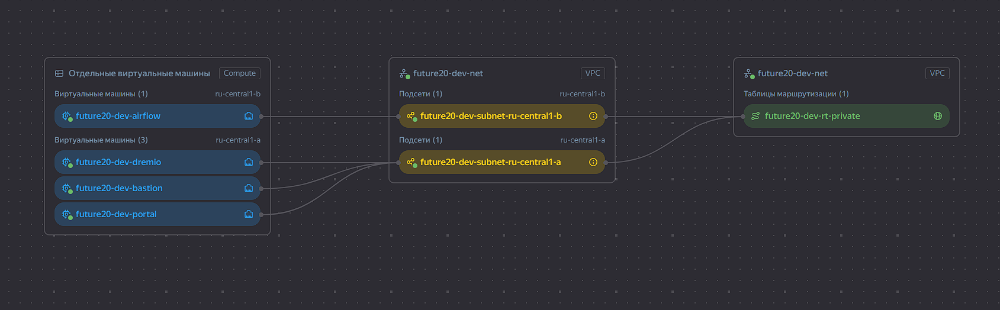

# Задание 4. Облачная инфраструктура и Infrastructure as Code

Terraform-конфигурация базового слоя платформы данных «Будущее 2.0» в Yandex Cloud:
сеть с NAT, группы безопасности, сервисный аккаунт, бакет lakehouse, виртуальные машины
платформы и балансировщик перед порталом самообслуживания.

## Состав

| Файл | Назначение |
|------|------------|
| [`main.tf`](main.tf) | Описание инфраструктуры: провайдер, сеть, доступы, хранилище, ВМ, балансировщик |
| [`variables.tf`](variables.tf) | Определение переменных с типами, значениями по умолчанию и валидацией |
| [`outputs.tf`](outputs.tf) | Вывод ключевых параметров: адреса узлов, точка входа, бакет, ключ доступа |
| [`terraform.tfvars`](terraform.tfvars) | Значения переменных для среды `dev` |
| [`diagram.png`](diagram.png) | Диаграмма автоматизации развёртывания: что управляется Terraform, а что вручную |
| [`diagram.drawio`](diagram.drawio) | Исходник диаграммы |
| [`justification.md`](justification.md) | Обоснование выбора ресурсов, параметров, NAT, декларативного подхода и IaC |
| [`verification.md`](verification.md) | Что проверено (`init`, `fmt`, `validate`, `test`) и что осталось выполнить с учётными данными |
| [`tests/platform.tftest.hcl`](tests/platform.tftest.hcl) | Автотесты: `plan` и `apply` на мок-провайдере, без облака и без затрат |

## Диаграмма автоматизации развёртывания


Три контура:

- **Оранжевый — вручную (bootstrap).** Облако, каталог, платёжный аккаунт, сервисный аккаунт
  Terraform с ключом, бакет под файл состояния, домен и TLS-сертификат. Всё это должно
  существовать до первого `terraform init`.
- **Фиолетовый — Terraform.** Сеть, NAT-шлюз, таблица маршрутов, подсети, группы безопасности,
  сервисный аккаунт узлов и его роли, бакет lakehouse, диски, виртуальные машины, балансировщик.
- **Зелёный — после `apply`.** Установка и настройка ПО, секреты, пользователи Keycloak,
  перенос данных, мониторинг. Провижинеры в конфигурации сознательно не используются —
  почему, написано в `justification.md`.

## Что создаётся

| Ресурс | Кол-во | Комментарий |
|--------|--------|-------------|
| `yandex_vpc_network` | 1 | Сеть платформы |
| `yandex_vpc_gateway` | 1 | NAT-шлюз: исходящий доступ без публичных адресов |
| `yandex_vpc_route_table` | 1 | Маршрут `0.0.0.0/0` на NAT-шлюз |
| `yandex_vpc_subnet` | 2 | По одной на зону доступности (`for_each`) |
| `yandex_vpc_security_group` | 2 | Бастион и узлы платформы |
| `yandex_iam_service_account` | 1 | Сервисный аккаунт узлов |
| `yandex_resourcemanager_folder_iam_member` | 4 | Роли сервисного аккаунта (`for_each`) |
| `yandex_iam_service_account_static_access_key` | 1 | Ключ доступа к бакету по S3 API |
| `yandex_storage_bucket` | 1 | Бакет lakehouse: версионирование, переход в COLD |
| `yandex_compute_disk` | 1 | Диск данных `dremio` |
| `yandex_compute_instance` | 4 | `bastion`, `dremio`, `airflow`, `portal` (`for_each`) |
| `yandex_lb_target_group` | 1 | Целевая группа портала |
| `yandex_lb_network_load_balancer` | 1 | Внешняя точка входа, TCP 443 → 8080 |
| **Итого** | **20** | 8 vCPU, 18 ГБ RAM, 80 ГБ network-hdd, 20 ГБ network-ssd |

## Как запустить

### Шаг 0. Подготовка вне Terraform

1. Создать облако и каталог в Yandex Cloud, привязать платёжный аккаунт.
2. Создать сервисный аккаунт для Terraform и выдать ему роль `admin` на каталог.
3. Получить авторизованный ключ этого сервисного аккаунта.
4. В [`terraform.tfvars`](terraform.tfvars) подставить свои значения вместо заполнителей:
   `cloud_id`, `folder_id`, `ssh_public_key` и `lakehouse_bucket_name`. Имя бакета уникально
   во всём Yandex Object Storage — замените суффикс на свой. Сам бакет создаёт эта
   конфигурация, заранее его заводить не нужно.
5. Указать путь к ключу:

```bash
export YC_SERVICE_ACCOUNT_KEY_FILE="$HOME/.yc/key.json"
```

### Шаг 1. init

Скачивает провайдер и готовит рабочий каталог.

```bash
terraform init
```

### Шаг 2. check

Форматирование, синтаксис и автотесты. Тесты гоняют `plan` и `apply` на мок-провайдере:
в облако не ходят, ресурсы не создают, учётные данные не нужны.

```bash
terraform fmt -check -recursive
```

```bash
terraform validate
```

```bash
terraform test
```

### Шаг 3. plan

Показывает, что именно будет создано, и сохраняет план в файл.

```bash
terraform plan -out="plan.tfplan"
```

### Шаг 4. apply

Применяет сохранённый план.

```bash
terraform apply "plan.tfplan"
```

### Шаг 5. destroy

После проверки среду сносим, чтобы не платить за простой.

```bash
terraform destroy
```

## Результат

```bash
Apply complete! Resources: 21 added, 0 changed, 0 destroyed.                                                                                                                                              

Outputs:                                                                                                                                                                                                  
                                                                                                                                                                                                          
bastion_public_ip = "46.21.245.121"                                                                                                                                                                       
lakehouse_access_key_id = "YCAJEy5pe8R6CZY48up8afIk3"
lakehouse_bucket = "future20-dev-lakehouse-0001"
lakehouse_endpoint = "https://storage.yandexcloud.net/future20-dev-lakehouse-0001"
lakehouse_secret_key = <sensitive>
nat_gateway_id = "enpkq1a2hgc5mljtiajd"
network_id = "enp6mu9587o2ccfd1jen"
node_internal_ips = {
  "airflow" = "10.10.2.15"
  "bastion" = "10.10.1.27"
  "dremio" = "10.10.1.18"
  "portal" = "10.10.1.15"
}
node_summary = {
  "airflow" = "airflow | ru-central1-b | 2 vCPU (20%) | 4 GB RAM | boot 20 GB network-hdd | data —"
  "bastion" = "bastion | ru-central1-a | 2 vCPU (20%) | 2 GB RAM | boot 20 GB network-hdd | data —"
  "dremio" = "dremio | ru-central1-a | 2 vCPU (100%) | 8 GB RAM | boot 20 GB network-hdd | data 20 GB network-ssd"
  "portal" = "portal | ru-central1-a | 2 vCPU (20%) | 4 GB RAM | boot 20 GB network-hdd | data —"
}
platform_service_account_id = "ajecou7gp0f7a5j638ji"
portal_endpoint = "https://158.160.193.6"
ssh_command = "ssh ubuntu@46.21.245.121"
subnet_ids = {
  "ru-central1-a" = "e9bv04mnvgfv9581f7jt"
  "ru-central1-b" = "e2le35olmuvmjm6puup9"
}
```


